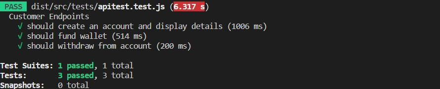

# Lendsqr Money tranfer API

## Assumption

It has been assumed that customers interact with this application and the API endpoints have only been created for this role.

## API documentation URL

https://documenter.getpostman.com/view/3707157/VUqmuyaz

## Live URL (Heroku)
https://ldqr-fundstransfer.herokuapp.com/

## To run locally

1. Clone the repository
    ```git clone <git_url>```

2. Run
    ```npm install``` to install the dependences

3. Create a ```.env``` file for enviroment variables in the root directory of the app folder

4. Copy example.env file and replace the DATABASE variables with the appropriate set up on your local host
    You can generate some ssh keys on your computer and replace the PUBLIC_KEY and PRIVATE_KEY

5.  ###  Run migrations
    Run ```Knex migrate:latest```

    NB: To rollback migration Run ```Knex migrate:rollback```

6.  ### Seed user data
    Run ```knex seed:run```

## Tests

Ensure you have set TEST_DATABASE_NAME to a different database in your ```.env``` file. This database will be used to house your data while the test is running so that the development database is not tampered with during tests.



Run ```npm run test```

To manually migrate and rollback migration in test environment;

Run 

```Knex migrate:latest --env=staging```


    NB: To rollback migration in test enviromment run 
    
```Knex migrate:rollback --env=staging```